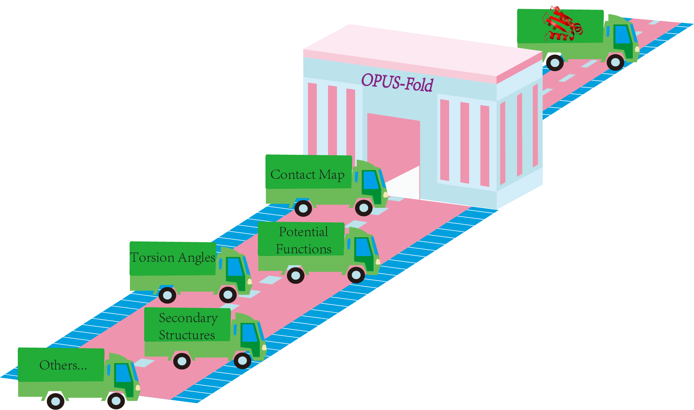
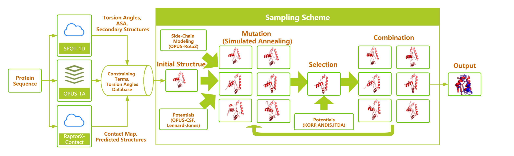

# OPUS-Fold



We propose a protein folding framework, named OPUS-Fold, which can integrate various methods for subproblems in protein structure prediction to contribute to folding. OPUS-Fold is based on torsion-angle sampling. After each sampling step, it reconstructs the structure and estimates the model quality with an energy function that is formed by combining many different constraining terms designed either by ourselves or by others in literature. OPUS-Fold balances the accuracy and the efficiency, delivers good results in a short time, and leaves more space for including the results of other subproblem methods. Moreover, OPUS-Fold also contains a fast side-chain modeling method OPUS-Rota2 (J. Chem. Theory Comput. 2019, 15 (9), 5154-5160), which enables a speedy construction of all-atom atomic models during the folding process that allows the usage of all-atom-required subproblem methods. In summary, OPUS-Fold provides a protein folding platform for incorporating the results from various subproblem methods, including those containing non-differentiable information such as partial experimental data.

## Framework of OPUS-Fold



## Energy terms

### OPUS-TA (Torsion-Angle-Sampling Database)

The information of OPUS-TA can be found [here](https://github.com/thuxugang/opus_refine).

### OPUS-CSF (Protein Potential)

The information of OPUS-CSF can be found [here](https://github.com/thuxugang/opus_csf).

### OPUS-Rota2 (Side-Chain Modeling Method)

The information of OPUS-Rota2 can be found [here](https://github.com/thuxugang/opus_rota2).

### Third-Party Programs (Already included)

Protein Potentials: KORP ANDIS ITDA

Secondary Structure Measurement: DSSP

### Third-Party Results (Should be added by users)

Contact Map: RaptorX-Contact

Inital Structure: RaptorX-Contact (CoinFold)

Torsion Angles & ASA & SS: SPOT-1D

## Test Set

The 103 native structures can be found in [here](https://github.com/thuxugang/opus_fold/tree/master/testset)

## Performance

### Performance of OPUS-Fold Using Different Energy Functions

To analyze the contribution of individual terms in the energy function, we introduce them into the energy function of OPUS-Fold one at a time accumulatively, and evaluate the performance in terms of folding accuracy.

||TM-score|	RMSD|	F1/S|	F1/M|	F1/L|	MAE(ϕ)|	MAE(ψ)|	Time |
|:----:|:----:|:----:|:----:|:----:|:----:|:----:|:----:|:----:|
|OPUS-TA|0.1717|13.2055 |	0.1010 |	0.0625| 	0.0411| 	21.90 |	40.54 |	1m|
|+Torsion Angles (SPOT-1D)|0.2603 |	14.0513 |	0.2863 |	0.1470 |	0.0373 |	13.13 |	15.15 |	1m|
|+OPUS-CSF|0.4457 |	8.1560 |	0.6678 |	0.4821 |	0.2098 |	**11.24** |	**12.59** |	1m|
|+Contact Map (RaptorX)|0.7037 |	1.9991 |	0.7697 |	0.7283| 	0.6797| 	12.60 |	14.52 	|1m37s|
|+Inital Structure (RaptorX)|0.7261 |	1.8069 |	0.7885 |	0.7648| 	0.7117| 	14.06 |	17.58 |	1m39s|
|+LJ potential|0.7299 |	1.7585 |	0.7886| 	0.7642 |	0.7165 |	14.07 |	17.62 |	2m41s|
|+OPUS-Rota2|0.7331|1.7459 |	0.7911| 	0.7657| 	0.7193 |	14.06 |	17.61 |	2m42s|
|+SS (SPOT-1D)|0.7351 |	1.7293 |	0.7959| 	0.7688 |	0.7223 |	14.06 |	17.63 	|5m47s|
|+ASA (SPOT-1D)|**0.7407** |	**1.6657** |	**0.7983** |	**0.7753**| 	**0.7317**| 	14.14| 	17.67| 	5m48s|
|SPOT-1D|-|	-|	-|	-|	-	|13.13 |	15.15 |	-|
|RaptorX-Contact|-	|-	|0.7417 |	0.7451 |	0.7016 |	-|	-	|-|
|Inital Structure (RaptorX)|	0.6595| 	2.3150| 	0.6754| 	0.6839| 	0.6468| 	21.63 |	29.71 |	-|


### Introducing Different Potentials into the Selection Step

Instead of introducing the constraining term into the energy function to participate in the optimization of the simulated annealing (SA) algorithm, the constraining term that is relatively time-consuming can be added to the selection step of the genetic algorithm (GA). 

||TM-score|	RMSD|F1/S|	F1/M|	F1/L|	Time|
|:----:|:----:|:----:|:----:|:----:|:----:|:----:|
|OPUS-Fold|	0.7407|	1.6657|	0.7983|	0.7753|	0.7317|	5m48s|
|w/KORP|0.7425 |	1.6489 |	0.7944 |	0.7775 |	0.7338 |	14m|
|w/IDTA|0.7439 |	1.6635 |	0.7962 |	0.7726 |	0.7369 |	15m|
|w/ANDIS|0.7459| 	1.6440 |	0.7991 |	0.7812| 	0.7373 |	1h20m|


## Dependency

```
Docker 18.09.7
```

## Usage

***The data in each line of the input file should be separated by a single ' ' or '\t'. '#' should be added at the beginning of each comment line.***

1. Download OPUS-Fold docker image.

   The docker image we used is hosted on [Baidu Drive](https://pan.baidu.com/s/1LdyJdkO7VebpORY2Fl7lmg) with password `z2xy`. Also, it can be downloaded directly from [Here](http://ma-lab.rice.edu/dist/opus_fold_docker.tar).

2. Docker image preparation.
   ```
   cat opus_fold_docker* | tar xvz
   docker load -i opus_fold_docker.tar
   docker run -it --name fold opus_fold:1.0
   docker start fold 
   docker attach fold 
   ```
   
3. Run MongoDB. 
   ```
   cd /home/mongodb/bin
   ./mongod -dbpath /home/mongodb/data/db -logpath /home/mongodb/log/mongodb.log -logappend -fork -port 27017
   ```    
4. Run OPUS-Fold.

   ```
   cd /home/opus_fold
   ./opus_fold
   ```    
   Please put the constrained contact map files and their corresponding list into `constains_files/contact_maps`, constrained torsional angles files and their corresponding list into `constains_files/torsion_angles` and initial structures files and their corresponding list into `constains_files/init_structures`.
 
 ***If you want to install OPUS-Fold in your environment, please download the source code and compile it. The source code is under the [source branch](https://github.com/thuxugang/opus_fold/tree/src).***
 
## Reference 
```bibtex
@article{xu2020opus2,
  title={OPUS-Fold: An Open-Source Protein Folding Framework Based on Torsion-Angle Sampling},
  author={Xu, Gang and Wang, Qinghua and Ma, Jianpeng},
  journal={Journal of Chemical Theory and Computation},
  year={2020},
  publisher={ACS Publications}
}
```
